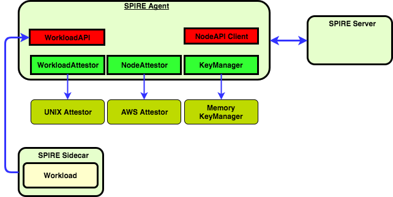

# SPIRE Agent

SPIRE Agent runs on every node and is responsible for requesting certificates from the spire server,
attesting the validity of local workloads, and providing them SVIDs.

## Agent configuration file

The following details the configurations for the spire agent. Agent specific configuration options are described under `agent { ... }`. The agent configurations can be set through .conf file or passed as command line args, the command line configurations takes precedence.

| Configuration      | Description                                                      | Default             |
| ------------------ | --------------------------------------------------------------- | -------------------- |
| `data_dir`          | A directory the agent can use for its runtime data             | $PWD                 |
| `log_file`          | File to write logs to                                          |                      |
| `log_level`         | Sets the logging level \<DEBUG\|INFO\|WARN\|ERROR\>            | INFO                 |
| `server_address`    | IP address or DNS name of the SPIRE server                     |                      |
| `server_port`       | Port number of the SPIRE server                                |                      |
| `socket_path`       | Location to bind the workload API socket                       | $PWD/spire_api       |
| `trust_bundle_path` | Path to the SPIRE server CA bundle                             |                      |
| `trust_domain`      | The trust domain that this agent belongs to                    |                      |
| `join_token`        | An optional token which has been generated by the SPIRE server |                      |
| `umask`           | Umask value to use for new files                                 | 0077                 |

**Note:** Changing the umask may expose your signing authority to users other than the SPIRE
agent/server.

## Plugin configuration

The agent configuration file also contains the configuration for the agent plugins.
Plugin configurations are under the `plugins { ... }` section, which has the following format:

```hcl
plugins {
    pluginType "pluginName" {
        ...
        plugin configuration options here
        ...
    }
}
```

The following configuration options are available to configure a plugin:

| Configuration   | Description                              |
| --------------- | ---------------------------------------- |
| plugin_cmd      | Path to the plugin implementation binary (optional, not needed for built-ins) |
| plugin_checksum | An optional sha256 of the plugin binary  (optional, not needed for built-ins) |
| enabled         | Enable or disable the plugin (enabled by default)            |
| plugin_data     | Plugin-specific data                     |

Please see the [built-in plugins](#built-in-plugins) section below for information on plugins that are available out-of-the-box.

## Command line options

### `spire-agent run`

All of the configuration file above options have identical command-line counterparts. In addition,
the following flags are available:

| Command          | Action                      | Default                 |
| ---------------- | --------------------------- | ----------------------- |
| `-config string` | Path to a SPIRE config file | conf/server/server.conf |

## Architecture

The agent consists of a master process (spire-agent) and three plugins - the Node Attestor, the
Workload Attestor and the Key Manager. The master process implements the Workload API and
communicates with spire-server via the Node API.



## Plugin types

| Type             | Description |
| ---------------- | ----------- |
| KeyManager       | Generates and stores the agent's private key. Useful for binding keys to hardware, etc. |
| NodeAttestor     | Gathers information used to attest the agent's identity to the server. Generally paired with a server plugin of the same type. |
| WorkloadAttestor | Introspects a workload to determine its properties, generating a set of selectors associated with it. |

## Built-in plugins

| Type             | Name | Description |
| ---------------- | ---- | ----------- |
| KeyManager       | [memory](/doc/plugin_agent_keymanager_memory.md) | An in-memory key manager which does not persist private keys (must re-attest after restarts) |
| KeyManager       | [disk](/doc/plugin_agent_keymanager_disk.md) | A key manager which writes the private key to disk |
| NodeAttestor     | [join_token](/doc/plugin_agent_nodeattestor_jointoken.md) | A node attestor which uses a server-generated join token |
| NodeAttestor     | [x509_pop](/doc/plugin_agent_nodeattestor_x509pop.md) | A node attestor which uses a pre-existing x.509 certificate and key |
| NodeAttestor     | [aws_iid](/doc/plugin_agent_nodeattestor_aws_iid.md) | An AWS IID attestor that automatically attests EC2 instances using the AWS Instance Metadata API and the AWS Instance Identity document. |
| NodeAttestor     | [azure_msi](/doc/plugin_agent_nodeattestor_azure_msi.md) | An Azure Node attestor that automatically attests Azure VMs using a signed Managed Service Identity (MSI) token. |
| NodeAttestor     | [gcp_iit](/doc/plugin_agent_nodeattestor_gcp_iit.md) | An Google Compute Engine Node attestor that automatically attests GCE instances using a signed token from Google retrieved via the Compute Engine Metadata API. |
| NodeAttestor     | [k8s_sat](/doc/plugin_agent_nodeattestor_k8s_sat.md) | A node attestor which attests agents using service account tokens inside of Kubernetes |
| WorkloadAttestor | [unix](/doc/plugin_agent_workloadattestor_unix.md) | A workload attestor which generates unix-based selectors like `uid` and `gid` |
| WorkloadAttestor | [k8s](/doc/plugin_agent_workloadattestor_k8s.md) | A workload attestor which allows selectors based on Kubernetes constructs such `ns` (namespace) and `sa` (service account)|

## Further reading

* [SPIFFE Reference Implementation Architecture](https://docs.google.com/document/d/1nV8ZbYEATycdFhgjTB619pwIvamzOjU6l0SyBGbzbo4/edit#)
* [Design Document: SPIFFE Reference Implementation (SRI)](https://docs.google.com/document/d/1RZnBfj8I5xs8Yi_BPEKBRp0K3UnIJYTDg_31rfTt4j8/edit#)
